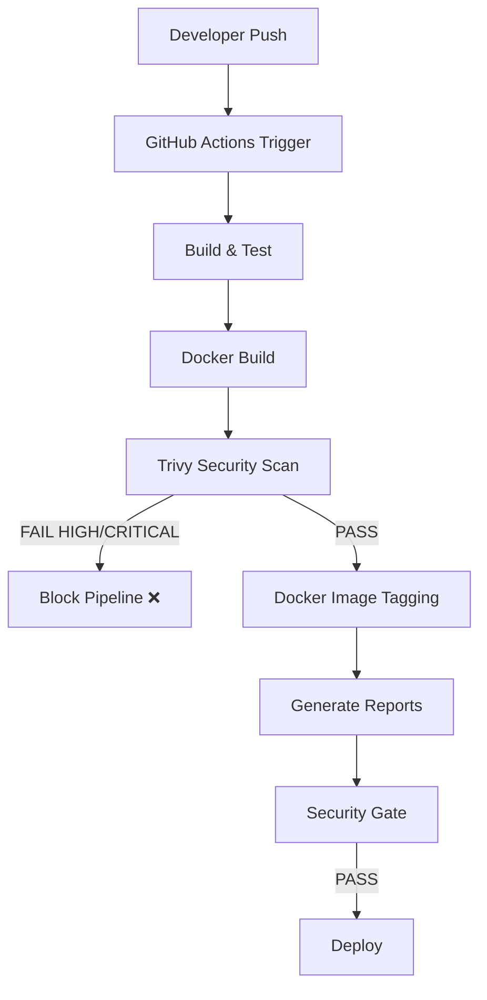

# Production-Ready DevSecOps CI/CD Pipeline with GitHub Actions & Trivy

##  Project Overview

This repository demonstrates a production-style DevSecOps CI/CD pipeline for a containerized Node.js application using GitHub Actions, Docker, and Trivy.

The pipeline integrates automated testing, Docker image builds, vulnerability scanning, security gates, SARIF security reporting, artifact management, and deployment automation.

The pipeline follows a Shift-Left DevSecOps approach, where vulnerabilities are identified and blocked before deployment.

---

## Tech Stack
- **Backend:** Node.js & Express
- **Containerization:** Docker
- **CI/CD:** GitHub Actions
- **Security:** Trivy, SARIF

---

##  CI/CD Dashboard

<!-- CI-REPORT-START -->
## 🚀 Release Summary

- Build: success
- Docker: Success
- Image: v1.0.74-091e8e1
- Version: v1.0.74
- Commit: 091e8e1

## 🔐 Security
- Trivy Scan: CRITICAL/HIGH enforced

## 📦 Flow
Build → Test → Docker → Scan → Tag → Deploy

🚀 System is production ready
<!-- CI-REPORT-END -->

---

##  CI/CD Pipeline Status

### 🔄 Workflows

  

  

  

---

### 🐳 Docker Metrics

  

  

---

<!-- TRIVY-TABLE-START -->
## 🔐 Vulnerability Report (Trivy)

| Severity | Package | Vulnerability | Installed Version | Fixed Version |
|---|---|---|---|---|

<!-- TRIVY-TABLE-END -->

This section is automatically updated by CI/CD pipeline using Trivy scan results.

---

<!-- AI-START -->
## 🤖 AI Release Notes

- Build completed successfully
- Docker image built and pushed
- Trivy scan completed
- README auto updated

<!-- AI-END -->

## CI/CD Pipeline Architecture

---

## Main Pipeline

Main Pipeline: https://github.com/malathi-shetty/github-actions-capstone/actions/runs/26508117638

---

## PR Pipeline

PR Pipeline: https://github.com/malathi-shetty/github-actions-capstone/actions/runs/26409652989

---

## Trivy Scan

####  Vulnerability Report (Trivy)

 Trivy Scan: https://github.com/malathi-shetty/github-actions-capstone/actions/runs/26501954363

---

## GitHub Security Tab 

#### Trivy SARIF results are uploaded directly into GitHub Code Scanning Alerts for centralized vulnerability visibility.

---

## Dependency Review

Dependency Review: https://github.com/malathi-shetty/github-actions-capstone/actions/runs/26462725296

---

## Docker Container Scheduled Health Check

Docker Container Scheduled Health Check: https://github.com/malathi-shetty/github-actions-capstone/actions/runs/26586977687

---

## pages build and deployment

Website: https://malathi-shetty.github.io/github-actions-capstone/

pages build and deployment: https://github.com/malathi-shetty/github-actions-capstone/actions/runs/26508117155

---

## Pin Commit SHA

 Pin Commit SHA: https://github.com/malathi-shetty/github-actions-capstone/actions/runs/26507329633

 ---

 ## Key Features

- Reusable GitHub Actions workflows
- Automated Docker image build & push
- Trivy vulnerability scanning (JSON + SARIF)
- GitHub Code Scanning integration
- Security gate enforcement for HIGH/CRITICAL CVEs
- Automated artifact generation
- Dependency review checks
- Scheduled Docker health checks
- GitHub Pages deployment
- Shift-Left DevSecOps implementation

---

## Acknowledgements

This project was developed as part of the 90 Days of DevOps learning journey and further extended with additional production-style DevSecOps practices and CI/CD automation.

The implementation includes enhancements such as:
* Reusable GitHub Actions workflows
* Docker image build and version tagging
* Trivy vulnerability scanning
* DevSecOps security integration with Trivy
* SARIF-based GitHub Code Scanning integration
* Security gate enforcement for HIGH/CRITICAL vulnerabilities
* Structured artifact generation and reporting
* Automated reporting workflows
* Dependency review checks
* Scheduled Docker health checks
* Scheduled health monitoring
* GitHub Pages deployment automation

---

## Learning references:

* [90 Days of DevOps — TrainWithShubham](https://github.com/malathi-shetty/90DaysOfDevOps_TrainWithShubham/tree/master/2026)
* [Day 48 — GitHub Actions CI/CD](https://github.com/malathi-shetty/90DaysOfDevOps_TrainWithShubham/tree/master/2026/day-48)
* [Day 49 — DevSecOps with Trivy & Security Automation](https://github.com/malathi-shetty/90DaysOfDevOps_TrainWithShubham/tree/master/2026/day-49)
