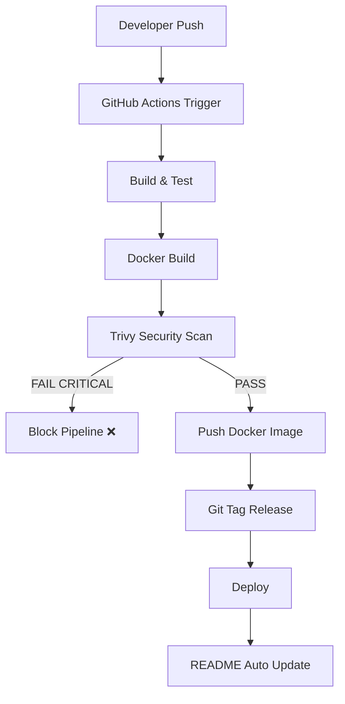

# 🚀 DevSecOps CI/CD Pipeline

## 📌 Project Overview
Node.js app with full CI/CD + security pipeline.

---

## 🛠️ Tech Stack
- Node.js
- Docker
- GitHub Actions
- Trivy

---

## 📊 CI/CD Dashboard

<!-- CI-REPORT-START -->
## 🚀 Release Summary

- Build: success
- Docker: Success
- Image: v1.0.74-091e8e1
- Version: v1.0.74
- Commit: 091e8e1

## 🔐 Security
- Trivy Scan: CRITICAL/HIGH enforced

## 📦 Flow
Build → Test → Docker → Scan → Tag → Deploy

🚀 System is production ready
<!-- CI-REPORT-END -->

---

## 🚀 CI/CD Pipeline Status

### 🔄 Workflows

---

### 🐳 Docker Metrics

---

## 🧱 CI/CD Architecture (Visual Flow)

----

- name: Inject Trivy Table into README
  run: |
    if [ -f trivy.md ]; then
      awk '
      /<!-- TRIVY-TABLE-START -->/ {print; system("cat trivy.md"); skip=1; next}
      /<!-- TRIVY-TABLE-END -->/ {skip=0}
      !skip
      ' README.md > tmp && mv tmp README.md
    fi

## 🔐 Vulnerability Report (Trivy)

<!-- TRIVY-TABLE-START -->
_No scan data yet_
<!-- TRIVY-TABLE-END -->

---

## 🤖 AI Release Notes

> Automatically generated using OpenAI during CI/CD execution

- Pipeline Summary: AI-generated per build
- Commit: Dynamic per run
- Version: Auto incremented
- Security: Trivy validated
- Status: Production-ready deployment

<!-- AI-START -->
Automatically generated during CI/CD pipeline.

- Uses OpenAI GPT model
- Summarizes build, docker, security, deployment
- Updated on every release
<!-- AI-END -->

