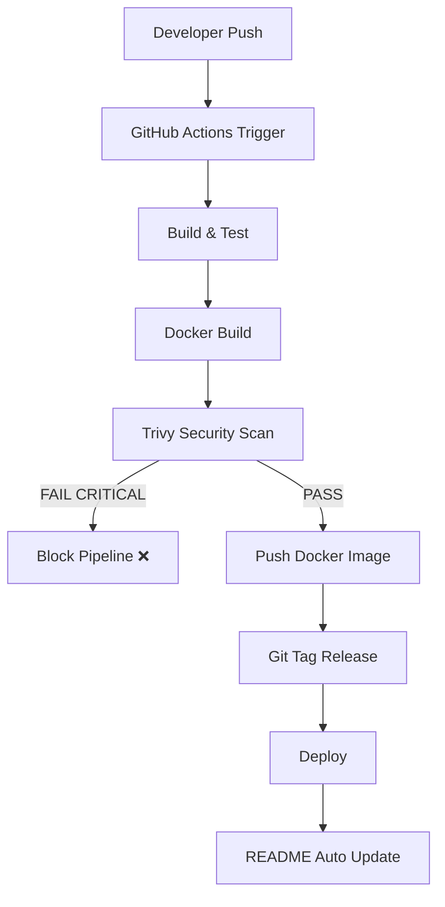

# 🚀 DevSecOps CI/CD Pipeline

## 📌 Project Overview
Node.js app with full CI/CD + security pipeline.

---

## 🛠️ Tech Stack
- Node.js
- Docker
- GitHub Actions
- Trivy

---

## 📊 CI/CD Dashboard

<!-- CI-REPORT-START -->
## 🚀 Release Summary

- Build: success
- Docker: Success
- Image: v1.0.74-091e8e1
- Version: v1.0.74
- Commit: 091e8e1

## 🔐 Security
- Trivy Scan: CRITICAL/HIGH enforced

## 📦 Flow
Build → Test → Docker → Scan → Tag → Deploy

🚀 System is production ready
<!-- CI-REPORT-END -->

---

## 🚀 CI/CD Pipeline Status

### 🔄 Workflows

PR Pipeline   
  

   
Main Pipeline   
  

Health Check

  

---

### 🐳 Docker Metrics

Docker Pulls
     
  

 
Docker Image Size   
  

---

<!-- TRIVY-TABLE-START -->
## 🔐 Vulnerability Report (Trivy)

| Severity | Package | Vulnerability | Installed Version | Fixed Version |
|---|---|---|---|---|

<!-- TRIVY-TABLE-END -->

This section is automatically updated by CI/CD pipeline using Trivy scan results.

---

<!-- AI-START -->
## 🤖 AI Release Notes

- Build completed successfully
- Docker image built and pushed
- Trivy scan completed
- README auto updated

<!-- AI-END -->

## 🧱 CI/CD Architecture (Visual Flow)

